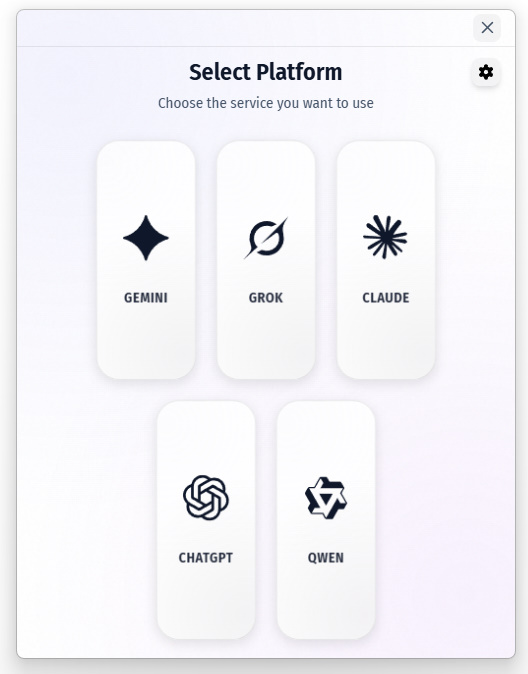
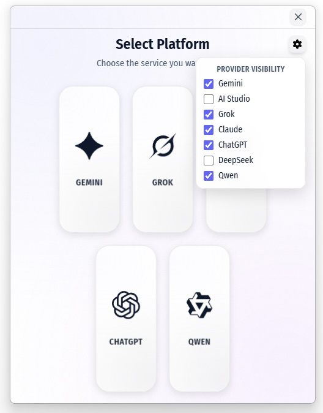
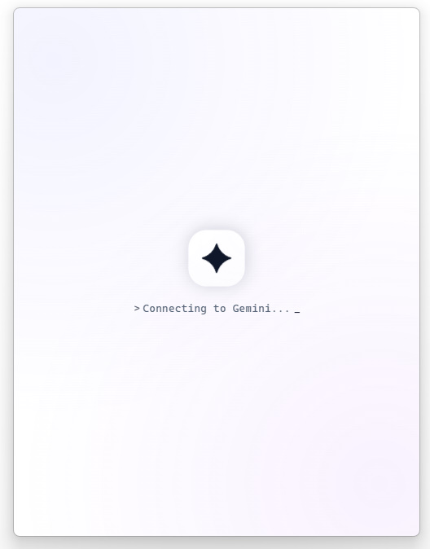
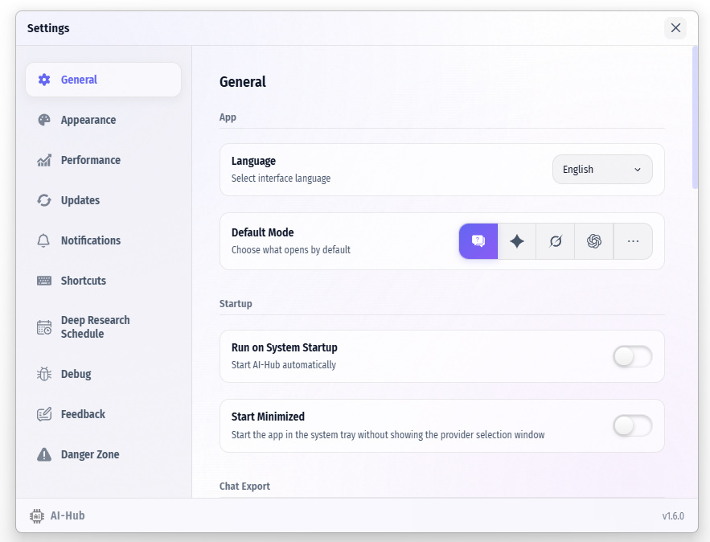
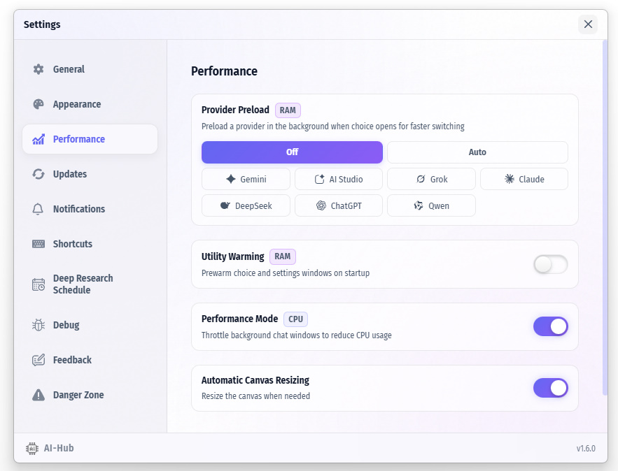
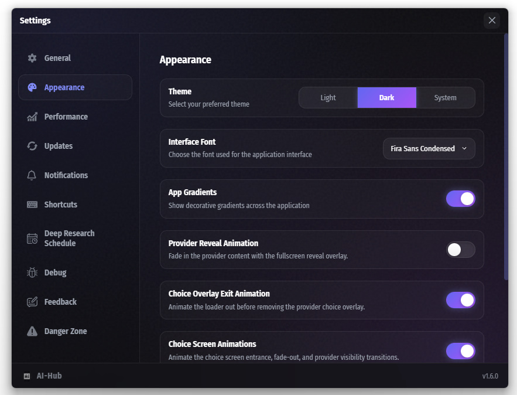

# AI Hub Desktop

AI Hub Desktop is a focused AI workspace for people who work with multiple models every day. Instead of juggling browser tabs and separate web apps, you can keep your AI tools in one desktop environment built for faster switching, cleaner context, and less friction.

Whether you are comparing answers, continuing ongoing chats, or running longer research tasks, the app keeps the workflow practical and organized. Open the provider you need, stay in a dedicated chat window, and move from idea to output without breaking concentration.

## Why AI Hub Desktop

AI Hub Desktop is designed to make daily AI work feel more like a professional tool and less like a collection of disconnected tabs.

- **One workspace for multiple providers** — access different AI services from a single desktop app and switch between sessions with less overhead.
- **Focused chat experience** — work in dedicated windows with navigation that helps keep conversations accessible and easy to manage.
- **Built for longer tasks** — schedule deep-research sessions when a prompt needs more time, structure, or follow-through.
- **Easy output sharing** — export and share conversations in common formats, including PDF, when results are ready to send or archive.
- **Stay up to date** — receive built-in notifications and update prompts so the app stays current without extra effort.

## What it helps you do

- Compare providers in a more practical desktop workflow
- Keep active AI sessions organized and easier to revisit
- Reduce context switching during writing, research, and iteration
- Turn useful conversations into shareable deliverables faster

## Product overview

AI Hub Desktop fits teams and individual users who want a more stable, repeatable way to work with AI across providers. It brings together everyday chat workflows, research-oriented sessions, and export-ready results in a lightweight desktop experience.

## Screenshots

|  |  |  |
|:---:|:---:|:---:|
|  |  |  |
